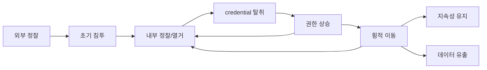

# Red Team Cheat Sheet

레드팀 / 모의침투 작업할 때 손에 닿게 두는 명령어 · 기법 · 도구 모음.

실제 공격 lifecycle 흐름에 맞춰 정리했고, 현장에서 바로 복붙할 수 있게 command 위주로 구성했다.

---

## 공격 lifecycle

| 단계 | 설명 |
|------|------|
| [외부 정찰](lifecycle/reconnaissance.md) | OSINT, 포트 스캔, 서비스 식별, directory 열거 |
| [초기 침투](lifecycle/initial-access.md) | 피싱, Password Spray, 외부 서비스 취약점 |
| [내부 정찰 및 열거](lifecycle/enumeration.md) | SMB, LDAP, RPC, AD 환경 열거 |
| [credential 탈취](lifecycle/credential-access.md) | Kerberoasting, AS-REP Roasting, DCSync, LLMNR Poisoning |
| [권한 상승](lifecycle/privilege-escalation.md) | Windows/Linux 로컬 권한 상승, AD DACL Abuse |
| [횡적 이동](lifecycle/lateral-movement.md) | PtH, PtT, WinRM, PSExec, DCOM |
| [지속성 유지](lifecycle/persistence.md) | Registry, Scheduled Task, Golden Ticket |
| [데이터 유출](lifecycle/exfiltration.md) | HTTP/DNS/ICMP/클라우드 채널을 통한 유출 |

---

## Techniques

Tactic 을 가로지르는 전용 기법. 각 문서는 OPSEC / 툴체인 / 실전 예시 중심.

| 분류 | 설명 |
|------|------|
| [OSINT / External Recon](techniques/osint.md) | CT 로그, Shodan, GitHub secret, LinkedIn, Breach 데이터 |
| [Phishing / Vishing](techniques/phishing.md) | GoPhish, Evilginx2 (AiTM), HTML Smuggling, MFA Fatigue |
| [Wireless / WiFi](techniques/wireless.md) | WPA2 PSK/Enterprise, Evil Twin, WPS, 802.1X NAC bypass |
| [물리 침투 / KIOSK](techniques/physical.md) | Tailgating, Proxmark3, Rubber Ducky, LAN Turtle, Drop Box |
| [Mobile (Android/iOS)](techniques/mobile.md) | APK/IPA 분석, Frida SSL unpin, backend API 공격 |

---

## 프로토콜별 펜테스트

포트 스캔 후 발견된 서비스에 대한 프로토콜별 공격 가이드.

| 프로토콜 | 포트 | 설명 |
|---------|------|------|
| [SMB](protocols/smb.md) | 445 | 파일/프린터 공유, AD 열거, PtH |
| [LDAP](protocols/ldap.md) | 389/636 | directory 서비스, AD 쿼리 |
| [HTTP](protocols/http.md) | 80/443 | 웹 서비스, directory/parameter 열거 |
| [WinRM](protocols/winrm.md) | 5985/5986 | PowerShell Remoting |
| [SSH](protocols/ssh.md) | 22 | Linux/Unix 원격 접근, tunneling |
| [FTP](protocols/ftp.md) | 21 | 파일 전송, Anonymous 접근 |
| [RDP](protocols/rdp.md) | 3389 | Windows 원격 데스크톱 |
| [DNS](protocols/dns.md) | 53 | Zone Transfer, subdomain 열거 |
| [Kerberos](protocols/kerberos.md) | 88 | 사용자 열거, AS-REP/Kerberoasting |
| [NTLM](protocols/ntlm.md) | - | Hash types, Responder, ntlmrelayx, PtH |
| [RPC](protocols/rpc.md) | 135/111 | MSRPC 열거, rpcclient |
| [MSSQL](protocols/mssql.md) | 1433 | xp_cmdshell, NTLM capture |
| [MySQL](protocols/mysql.md) | 3306 | UDF, 파일 읽기/쓰기 |
| [SNMP](protocols/snmp.md) | 161 | Community String, 정보 수집 |
| [NFS](protocols/nfs.md) | 2049 | 마운트, root squashing 우회 |
| [SMTP](protocols/smtp.md) | 25 | 사용자 열거, 메일 스푸핑 |

---

## 기술별 분류

| 분류 | 설명 |
|------|------|
| [AD 환경 공격](ad/ad-environment.md) | 인증 프로토콜별 공격, Delegation, NTLM Relay, Trust |
| [DACL Abuse](ad/dacl-abuse.md) | BloodHound 엔지 기반 권한 상승, DCSync |
| [NTLM Coercion](ad/coercion.md) | PetitPotam, PrinterBug, DFSCoerce, ShadowCoerce, WebClient |
| [SCCM/MECM](ad/sccm.md) | NAA 탈취, Client Push relay, Site takeover |
| [ADCS](ad/adcs.md) | ESC1~ESC16 인증서 템플릿 공격 |
| [Web 공격](web/index.md) | SQLi, XSS, SSRF, SSTI, JWT, Deserialization |
| [Cloud 공격](cloud/index.md) | AWS, Azure 클라우드 환경 공격 |
| [방어 우회](evasion/index.md) | AV/EDR 우회, AMSI bypass, AppLocker bypass |

---

## operation 인프라

| 항목 | 설명 |
|------|------|
| [reverse shell](infra/shells.md) | 다양한 언어/환경별 shell payload |
| [파일 전송](infra/file-transfer.md) | HTTP, SMB, SCP, Base64 encoding 전송 |
| [피봇 / tunneling](infra/pivoting.md) | Ligolo-ng, Chisel, SSH, sshuttle |
| [C2 framework](infra/c2.md) | Sliver, Havoc, Cobalt Strike |
| [도구 레퍼런스](tools/index.md) | 주요 도구별 명령어 정리 |
