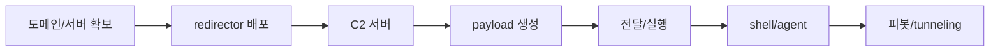

# Operation Infrastructure

작전을 돌리는 데 필요한 계수을 모아 둔 섹션. Shell 획득, 파일 전송, pivot / tunneling, C2 framework.

---

## 구성 요소

| 항목 | 설명 |
|------|------|
| [reverse shell](shells.md) | target에서 공격자로 연결하는 shell payload |
| [파일 전송](file-transfer.md) | 공격자 ↔ target 간 파일 전송 방법 |
| [피봇 / tunneling](pivoting.md) | 내부 네트워크 접근을 위한 tunneling |
| [C2 framework](c2.md) | Command & Control framework |

---

## 인프라 구축 흐름

---

## 펜테스트 방법론 체크리스트

> HackTricks Pentesting Methodology를 사내 워크플로에 맞춰 축약 정리. 과업/스코프에 따라 항목을 선택적으로 수행한다.

- [ ] 0. 물리적 접근: 스코프에 포함된 경우에만 수행 (키오스크/물리 공격)
- [ ] 1. 자산 식별: 외부(도메인, ASN, CT 로그)/내부(ARP/Nmap) → [외부 정찰](../lifecycle/reconnaissance.md)
- [ ] 2. 네트워크 관찰: 패시브/Active(MitM, LLMNR/NBT-NS) → [Responder](../tools/index.md#responder)
- [ ] 3. 포트/서비스 스캔: 빠른 전체 → 정밀 스캔 → 결과 태깅
- [ ] 4. 버전 취약점 탐색: PoC 검증 전 스코프/안전성 확인
- [ ] 5. 서비스별 점검: 웹/DB/메시징/CI 등 → [프로토콜별](../protocols/index.md)
- [ ] 6. 피싱/소셜: 인프라, 도메인, 템플릿 준비 → [초기 침투](../lifecycle/initial-access.md)
- [ ] 7. shell 획득: reverse shell/agent → [reverse shell](../infra/shells.md), [C2](../infra/c2.md)
- [ ] 8. 호스트 내부: 퀵 트리아지(계정/token/파일/키링) → OPSEC
- [ ] 9. 데이터 유출/투입: 안전 채널 선정 → [데이터 유출](../lifecycle/exfiltration.md)
- [ ] 10. 로컬/도메인 권한상승: 윈도우/리눅스/AD → [권한 상승](../lifecycle/privilege-escalation.md), [AD](../ad/ad-environment.md)
- [ ] 11. POST: 루팅/시크릿 추가 수집, [지속성 유지](../lifecycle/persistence.md)
- [ ] 12. 피봇/tunneling: 새로운 세그먼트로 확장 → [피봇/tunneling](../infra/pivoting.md)

!!! tip "증거 수집/기록"
    각 단계 산출물(nmap 결과, 스크린샷, 명령 로그, 타임스탬프)을 정리해 재현/보고서 작성과 탐지 매핑(ATT&CK) 기반 개선에 활용하세요.

---

## OPSEC 체크리스트

### 외부 인프라

- [ ] **도메인**: 평판 있는 카테고리(finance, health, news 등)로 수명 1개월 이상 도메인 구매. 신규 의심 TLD(`.xyz`, `.top`, `.click` 등)는 차단 확률이 매우 높음
- [ ] **redirector**: C2 서버를 직접 노출하지 말고 Apache/Nginx/Caddy 기반 redirector를 앞단에 배치. Cobalt Strike Malleable Profile / Sliver HTTPS Profile 로 트래픽 패턴 은닉
- [ ] **CDN / Domain Fronting**: Cloudflare, Fastly, Azure Front Door 등 SNI 은닉 옵션. 대부분 플랫폼이 막아두었으므로 사전 확인 필수
- [ ] **TLS 인증서**: Let's Encrypt 로 유효 인증서 발급. 자체 서명/만료 인증서는 클라이언트에서 차단됨
- [ ] **C2 프로파일**: 기본 프로파일 그대로 사용 금지. User-Agent / URI / header 순서 / JA3 모두 수정

### payload

- [ ] build 직후 사내 sandbox 또는 `AntiScan.me` / `KleenScan` 로 탐지율 확인 (VirusTotal 은 공유되므로 **upload 금지**)
- [ ] 코드 서명 인증서 + 타임스탬프 + 리소스 정보(아이콘/버전) 삽입
- [ ] 지연 실행(sleep jitter), Sandbox 탐지(VM artifact / 사용자 상호작용)
- [ ] 도메인 / 프로세스 / 사용자 / 시간 제약 조건으로 **target 환경에서만 동작**하도록 제한

### 트래픽

- [ ] **비콘 지터** 최소 20% 이상 랜덤화
- [ ] target의 **업무 시간대**에만 체크인 하도록 스케줄
- [ ] 대용량 엑스필은 별도 채널 (Cloud Storage, 사내 허용 웹메일 등) 사용
- [ ] 방화벽이 엄격한 환경에서는 **DNS / DoH 폴백 채널** 준비

---

## 상황별 권장 조합

| 상황 | 권장 조합 |
|------|-----------|
| 학습 / CTF | `nc` + `python3 -m http.server` + `chisel` |
| 중소 인게이지먼트 | Sliver + Caddy redirector + Ligolo-ng |
| 대규모 / 장기 인게이지먼트 | Cobalt Strike / Mythic + Malleable C2 + 다단 redirector |
| Air-gapped / 강한 필터링 | DNS C2 (`dnscat2`, Sliver DNS) + USB 드롭 |

---

## 참고 사항

- 인프라는 **재사용 금지**. 한 번 탐지된 도메인/IP는 평판이 타버리므로 엔게이지먼트마다 신규로 구성한다
- 각 단계별 session/TTP/타임스탬프를 **문서화**하여 디브리핑 및 탐지 매핑(ATT&CK)에 활용
- 세부 도구/payload별 사용법은 하위 페이지 참고
