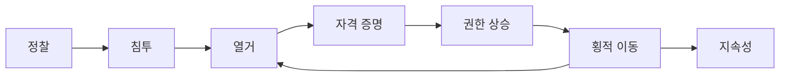

# Red Team Cheat Sheet

펜테스팅 / 레드팀 현장에서 자주 쓰는 명령어 모음.

---

## 공격 흐름

| 단계 | 핵심 도구 |
|------|----------|
| 정찰 | nmap, ffuf, feroxbuster |
| 자격 증명 | Impacket, Responder, Hashcat |
| 권한 상승 | WinPEAS, LinPEAS, Potato |
| 횡적 이동 | PSExec, Evil-WinRM, xfreerdp |
| AD | BloodHound, Certipy, bloodyAD |
